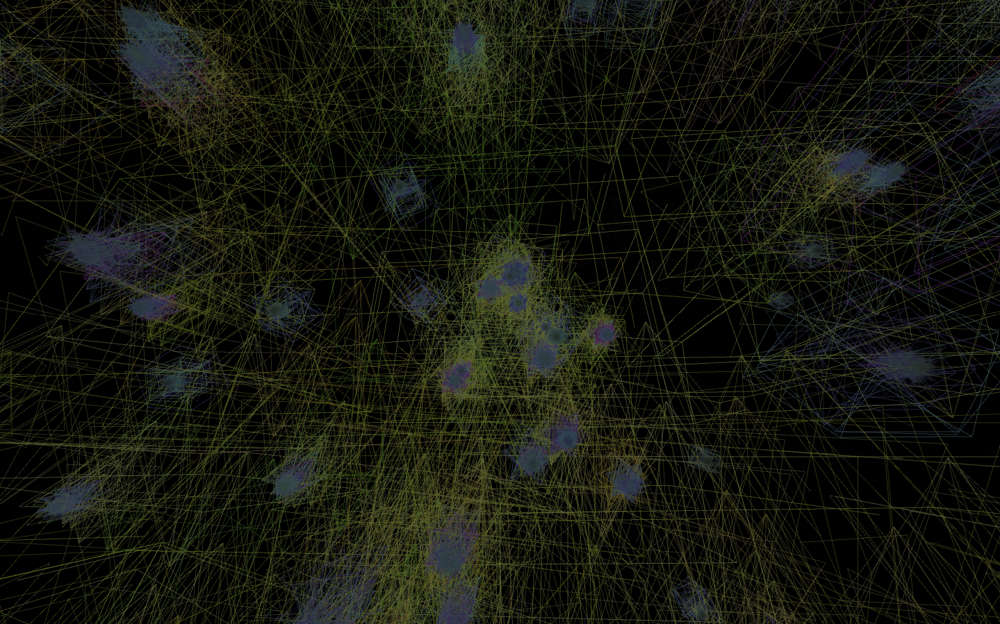
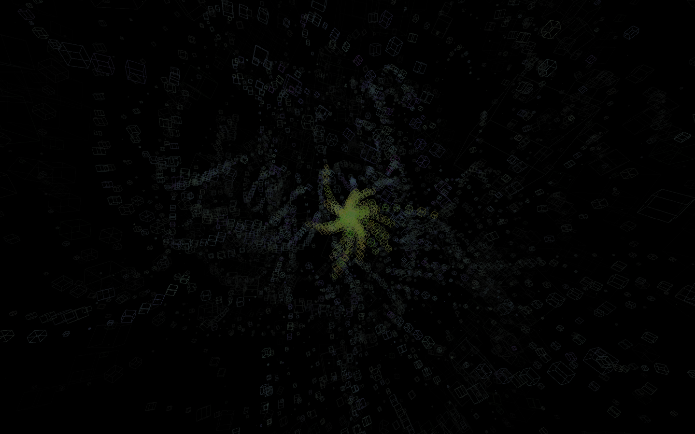
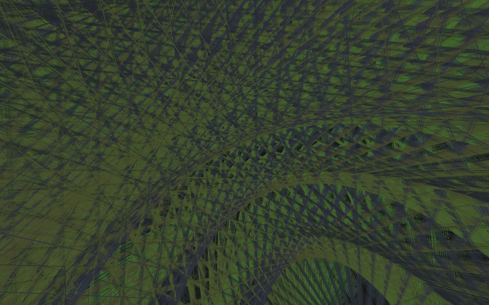

# VISUALIZER

An fft music/audio visualizer in Processing.

Hotkeys:
- Left/right arrow keys decrease/increase gain (i.e. gain/=2, gain*=2)
- Holding 'j' disables background drawing, causing trails 
- Camera can be controlled by zooming, m1 click-dragging, and middle click-draggin

